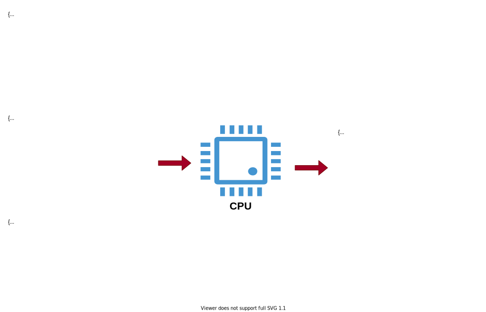

# Talk on different MongoDB schema design patterns
There are multiple schema design patterns that could be applied for our project, but choosing the pattern which is efficient, cost-effective and memory efficient is hard to decide. Below are some of the schema design patters and their use cases. Our project could be treated as a project of IoT (Interet of Things) domain.


1. Approximation Pattern
2. Arrribute Pattern
3. Bucket Pattern
4. Computed Pattern
5. Document Versioning Pattern
6. Extended Reference Pattern
7. Outlier Pattern
9. Polymorphic Pattern
10. Schema Versioning Pattern
11. Subset Pattern
12. Tree and Graph Pattern


## Approximation Pattern
As the name suggests this pattern is handy when we want something "good enough" or the accuracy of the count is not mission critical. An example would be keeping track of people where the number is prety fluid as people move in and out of the city, some children is born and some people might die. So, here instead of writing to the database for every addition and deletion of an user we can count the number of users till it adds upto 100 and then update the number of users in the database, this will save the number of write operations that are performed on the database.

Why should we be concerned with this? Well, when working with large amounts of data or large numbers of users, the impact on performance of write operations can get to be large too. The more you scale up, the greater that impact is too and at scale, that's often your most important consideration. By reducing writes and reducing resources for data that doesn't need to be "perfect," it can lead to huge improvements in performance.

The Approximation Pattern is an excellent solution for applications that work with data that is difficult and/or expensive to compute and the accuracy of those numbers isn't mission critical. We can make fewer writes to the database increasing performance and still maintain statistically valid numbers. The cost of using this pattern, however, is that exact numbers aren't being represented and that the implementation must be done in the application itself.

## Attribute Pattern
The Attribute pattern is well suited when:

1. We have big documents with many similar fields but there is a subset of fields that share common characteristics and we want to sort or query on that subset of fields.
2. The fields we need to sort on are only found in a small subset of documents.
3. Both of the above conditions are met within the documents.

For performance reasons, to optimize our search we’d likely need many indexes to account for all of the subsets. Creating all of these indexes could reduce performance. The Attribute Pattern provides a good solution for these cases.

Consider the scenario where we are trying to fetch the release dates for different movies from the movies collection. The documents will likely have similar fields involved across all of the documents: title, director, producer, cast, etc. Let’s say we want to search on the release date. A challenge that we face when doing so, is which release date? Movies are often released on different dates in different countries.

```json
{
    title: "Star Wars",
    director: "George Lucas",
    ...
    release_US: ISODate("1977-05-20T01:00:00+01:00"),
    release_France: ISODate("1977-10-19T01:00:00+01:00"),
    release_Italy: ISODate("1977-10-20T01:00:00+01:00"),
    release_UK: ISODate("1977-12-27T01:00:00+01:00"),
    ...
}
```

A search for a release date will require looking across many fields at once. In order to quickly do searches for release dates, we’d need several indexes on our movies collection:

```json
{release_US: 1}
{release_France: 1}
{release_Italy: 1}
```

By using the Attribute Pattern, we can move this subset of information into an array and reduce the indexing needs. We turn this information into an array of key-value pairs:

```json
{
    title: "Star Wars",
    director: "George Lucas",
    …
    releases: [
        {
        location: "USA",
        date: ISODate("1977-05-20T01:00:00+01:00")
        },
        {
        location: "France",
        date: ISODate("1977-10-19T01:00:00+01:00")
        },
        {
        location: "Italy",
        date: ISODate("1977-10-20T01:00:00+01:00")
        },
        {
        location: "UK",
        date: ISODate("1977-12-27T01:00:00+01:00")
        },
        … 
    ],
    … 
}
```

By using the Attribute Pattern we can add organization to our documents for common characteristics and account for rare/unpredictable fields. For example, a movie released in a new or small festival. Further, moving to a key/value convention allows for the use of non-deterministic naming and the easy addition of qualifiers. For example, if our data collection was on bottles of water, our attributes might look something like:

```json
"specs": [
    { k: "volume", v: "500", u: "ml" },
    { k: "volume", v: "12", u: "ounces" }
]
```

Here we break the information out into keys and values, “k” and “v”, and add in a third field, “u” which allows for the units of measure to be stored separately.

```json
{"specks.k": 1, "specs.v": 1, "specs.u": 1}
```

## Bucket Pattern
This pattern is particularly effective when working with Internet of Things (IoT), Real-Time Analytics, or Time-Series data in general. By bucketing data together we make it easier to organize specific groups of data, increasing the ability to discover historical trends or provide future forecasting and optimize our use of storage.

With data coming in as a stream over a period of time (time series data) we may be inclined to store each measurement in its own document. However, this inclination is a very relational approach to handling the data. If we have a sensor taking the temperature and saving it to the database every minute, our data stream might look something like:

```
{
   sensor_id: 12345,
   timestamp: ISODate("2019-01-31T10:00:00.000Z"),
   temperature: 40
}

{
   sensor_id: 12345,
   timestamp: ISODate("2019-01-31T10:01:00.000Z"),
   temperature: 40
}

{
   sensor_id: 12345,
   timestamp: ISODate("2019-01-31T10:02:00.000Z"),
   temperature: 41
}
```

This can pose some issues as our application scales in terms of data and index size. For example, we could end up having to index sensor_id and timestamp for every single measurement to enable rapid access at the cost of RAM. By leveraging the document data model though, we can "bucket" this data, by time, into documents that hold the measurements from a particular time span. We can also programmatically add additional information to each of these "buckets".

By applying the Bucket Pattern to our data model, we get some benefits in terms of index size savings, potential query simplification, and the ability to use that pre-aggregated data in our documents. Taking the data stream from above and applying the Bucket Pattern to it, we would wind up with:

```
{
    sensor_id: 12345,
    start_date: ISODate("2019-01-31T10:00:00.000Z"),
    end_date: ISODate("2019-01-31T10:59:59.000Z"),
    measurements: [
       {
       timestamp: ISODate("2019-01-31T10:00:00.000Z"),
       temperature: 40
       },
       {
       timestamp: ISODate("2019-01-31T10:01:00.000Z"),
       temperature: 40
       },
       … 
       {
       timestamp: ISODate("2019-01-31T10:42:00.000Z"),
       temperature: 42
       }
    ],
   transaction_count: 42,
   sum_temperature: 2413
}
```

By using the Bucket Pattern, we have "bucketed" our data to, in this case, a one hour bucket. This particular data stream would still be growing as it currently only has 42 measurements; there's still more measurements for that hour to be added to the "bucket". When they are added to the measurements array, the transaction_count will be incremented and sum_temperature will also be updated.

With the pre-aggregated sum_temperature value, it then becomes possible to easily pull up a particular bucket and determine the average temperature (sum_temperature / transaction_count) for that bucket. When working with time-series data it is frequently more interesting and important to know what the average temperature was from 2:00 to 3:00 pm in Corning, California on 13 July 2018 than knowing what the temperature was at 2:03 pm. By bucketing and doing pre-aggregation we're more able to easily provide that information

When working with time-series data, using the Bucket Pattern in MongoDB is a great option. It reduces the overall number of documents in a collection, improves index performance, and by leveraging pre-aggregation, it can simplify data access.

## Computed Pattern
The Computed Pattern is utilized when we have data that needs to be computed repeatedly in our application. The Computed Pattern is also utilized when the data access pattern is read intensive; for example, if you have 1,000,000 reads per hour but only 1,000 writes per hour, doing the computation at the time of a write would divide the number of calculations by a factor 1000.



In our movie database example, we can do the computations based on all of the screening information we have on a particular movie, compute the result(s), and store them with the information about the movie itself. In a low write environment, the computation could be done in conjunction with any update of the source data. Where there are more regular writes, the computations could be done at defined intervals - every hour for example. Since we aren't interfering with the source data in the screening information, we can continue to rerun existing calculations or run new calculations at any point in time and know we will get correct results.

Other strategies for performing the computation could involve, for example, adding a timestamp to the document to indicate when it was last updated. The application can then determine when the computation needs to occur. Another option might be to have a queue of computations that need to be done. Selecting the update strategy is best left to the application developer.

## Document Versioning Pattern
This pattern addresses the problem of wanting to keep around older revisions of some documents in MongoDB instead of bringing in a second management system. To accomplish this, we add a field to each document allowing us to keep track of the document version. The database will then have two collections: one that has the latest (and most queried data) and another that has all of the revisions of the data.

The Document Versioning Pattern makes a few assumptions about the data in the database and the data access patterns that the application makes.

* Each document doesn’t have too many revisions.
* There aren’t too many documents to version.
* Most of the queries performed are done on the most current version of the document.

If you find that these assumptions don’t fit your use case, this pattern may not be a great fit. You may have to alter how you implement your version of the Document Versioning Pattern or your use case may simply require a different solution.

Consider example of a famous insurance company, the Document Versioning Pattern is very useful in highly regulated industries that require a specific point in time version of a set of data. Financial and healthcare industries are good examples. Insurance and legal industries are some others. There are many use cases that track histories of some portion of the data.

Think of how an insurance company might make use of this pattern. Each customer has a “standard” policy and a second portion that is specific to that customer, a policy rider if you will. This second portion would contain a list of policy add-ons and a list of specific items that are being insured. As the customer changes what specific items are insured, this information needs to be updated while the historical information needs to be available as well. This is fairly common in homeowner or renters insurance policies. For example, if someone has specific items they want to be insured beyond the typical coverage provided, they are listed separately, as a rider. Another use case for the insurance company may be to keep all the versions of the "standard policy" they have mailed to their customers over time.

If we take a look at the requirements for the Document Versioning Pattern, this seems like a great use case. The insurance company likely has a few million customers, the revisions to the “add-on” list likely don’t occur too frequently, and the majority of searches on a policy will be about the most current version.

Inside our database, each customer might have a current_policy document — containing customer specific information — in a current_policies collection and policy_revision documents in a policy_revisions collection. Additionally, there would be a standard_policy collection that would be the same for most customers. When a customer purchases a new item and wants it added to their policy, a new policy_revision document is created using the current_policy document. A version field in the document is then incremented to identify it as the latest revision and the customer's changes added.

**Original *current_policy* document**
```
{
    _id : ObjectId<ObjectId>,
    name: 'shashank',
    revision: 1,
    items_insured: ['Elven-sword'],
    ...
}
```

**New *policy_revision* document**
```
{
    _id: ObjectId<ObjectId>,
    name: 'shashank',
    revision: 1,
    items_insured: ['Elven-sword'],
    ...
}
```

**New *current_policy* document**
```
{
    _id: ObjectId<ObjectId>,
    name: 'shashank',
    revision: 2,
    items_insured: ['Elven-sword', 'One-ring'],
    ...
}
```

The newest revision will be stored in the current_policies collection and the old version will be written to the policy_revisions collection. By keeping the latest versions in the current_policy collection queries can remain simple. The policy_revisions collection might only keep a few versions back as well, depending on data needs and requirements.

***current_policies* collection**
```
{
    _id: ObjectId<ObjectId>,
    name: 'Bilbo Baggins',
    revision: 2,
    ...
},
{
    _id: ObjectId<ObjectId>,
    name: 'Gandalf',
    revision: 12,
    ...
}
```

***policy_revision* collection**
```
{
    _id: ObjectId<ObjectId>,
    name: 'Bilbo Baggins',
    revision: 1,
    ...
},
{
    _id: ObjectId<ObjectId>,
    name: 'Gandalf',
    revision: 11,
    ...
},
{
    _id: ObjectId<ObjectId>,
    name: 'Gandalf',
    revision: 10,
    ...
},
{
    _id: ObjectId<ObjectId>,
    name: 'Gandalf',
    revision: 9,
    ...
}
```

In this example then, Middle-earth Insurance would have a standard_policy for its customers. All residents of The Shire would share this particular policy document. Bilbo has specific things he wants insuring on top of his normal coverage. His Elven Sword and, eventually, the One Ring are added to his policy. These would reside in the current_policies collection and as changes are made the policy_revisions collection would keep a historical record of changes.

The Document Versioning Pattern is relatively easy to accomplish. It can be implemented on existing systems without too many changes to the application or to existing documents. Further, queries accessing the latest version of the document remain performant.

One drawback to this pattern is the need to access a different collection for historical information. Another is the fact that writes will be higher overall to the database. This is why one of the requirements to use this pattern is that it occurs on data that isn’t changed too frequently.

When you need to keep track of changes to documents, the Document Versioning Pattern is a great option. It is relatively easy to implement and can be applied to an existing set of documents. Another benefit is that queries to the latest version of data still perform well. It does not, however, replace a dedicated version control system.

## Extended reference pattern
There are times when having separate collections for data make sense. If an entity can be thought of as a separate "thing", it often makes sense to have a separate collection. For example, in an e-commerce application, the idea of an order exists, as does a customer, and inventory. They are separate logical entities.


**Order Collection**
```
{
    _id: ObjectId("56578908765172890"),
    date: ISO("2019-02-18"),
    customer_id: 123,
    order: [
        {
            product: "widget",
            qty: 5,
            cost: {
                value: NumberDecimal("11.99"),
                currency: "USD"
            }
        }
    ]
}
```

**Customer Collection**
```
{
    _id: 123,
    name: "katrina Pope",
    street: "123 Main St",
    city: "somewhere",
    country: "someplace",
    ...
}
```

**Inventory Collection**
```
{
    _id: ObjectId("89876543234567890"),
    name: "widget",
    cost: {
        value: NumberDecimal("11.99"),
        currency: "USD"
    }
    on_hand: 98325,
    ...
}
```

From a performance standpoint, however, this becomes problematic as we need to put the pieces of information together for a specific order. One customer can have N orders, creating a 1-N relationship. From an order standpoint, if we flip that around, they have an N-1 relationship with a customer. Embedding all of the information about a customer for each order just to reduce the JOIN operation results in a lot of duplicated information. Additionally, not all of the customer information may be needed for an order.

The Extended Reference pattern provides a great way to handle these situations. Instead of duplicating all of the information on the customer, we only copy the fields we access frequently. Instead of embedding all of the information or including a reference to JOIN the information, we only embed those fields of the highest priority and most frequently accessed, such as name and address.

**Customer Collection**
```
{
    _id: 123,
    name: "katrina Pope",
    street: "123 Main St",
    city: "somewhere",
    country: "someplace",
    date_of_birth: ISODate("1992-11-03"),
    social_handles: {
        twitter: "@somethingamazing123"
    }
    ...
}
```

```
        |
        |
        |
        |
        V
```

**Order Collection**
```
{
    _id: ObjectId("56578908765172890"),
    date: ISO("2019-02-18"),
    customer_id: 123,

    #OBSERVE HERE
    shipping_address: {
        name: "katrina Pope",  <----
        street: "123 Main St", <----
        city: "somewhere",     <----
        country: "someplace",  <----
        ...
    }


    order: [
        {
            product: "widget",
            qty: 5,
            cost: {
                value: NumberDecimal("11.99"),
                currency: "USD"
            }
        }
    ]
}
```

Something to think about when using this pattern is that data is duplicated. Therefore it works best if the data that is stored in the main document are fields that don't frequently change. Something like a user_id and a person's name are good options. Those rarely change.

Also, bring in and duplicate only that data that's needed. Think of an order invoice. If we bring in the customer's name on an invoice, do we need their secondary phone number and non-shipping address at that point in time? Probably not, therefore we can leave that data out of the invoice collection and reference a customer collection.

When information is updated, we need to think about how to handle that as well. What extended references changed? When should those be updated? If the information is a billing address, do we need to maintain that address for historical purposes, or is it okay to update? Sometimes duplication of data is better because you get to keep the historical values, which may make more sense. The address where our customer lived at the time we ship the products make more sense in the order document, then fetching the current address through the customer collection.

An order management application is a classic use case for this pattern. When thinking about N-1 relationships, orders to customers, we want to reduce the joining of information to increase performance. By including a simple reference to the data that would most frequently be JOINed, we save a step in processing.

If we continue with the example of an order management system, on an invoice Acme Co. may be listed as the supplier for an anvil. Having the contact information for Acme Co. probably isn't super important from an invoice standpoint. That information is better served to reside in a separate supplier collection, for example. In the invoice collection, we'd keep the needed information about the supplier as an extended reference to the supplier information.

## Outlier Pattern
magine you are starting an e-commerce site that sells books. One of the queries you might be interested in running is "who has purchased a particular book". This could be useful for a recommendation system to show your customers similar books of interest. You decide to store the user_id of a customer in an array for each book. Simple enough, right?

Well, this may indeed work for 99.99% of the cases, but what happens when J.K. Rowling releases a new Harry Potter book and sales spike in the millions? The 16MB BSON document size limit could easily be reached. Redesigning our entire application for this outlier situation could result in reduced performance for the typical book, but we do need to take it into consideration.

With the Outlier Pattern, we are working to prevent a few queries or documents driving our solution towards one that would not be optimal for the majority of our use cases. Not every book sold will sell millions of copies.

A typical book document storing user_id information might look something like:
```
{
    "id": ObjectId("5689sdfsvv6s90sssas09876"),
    "title" : "Adobe Acrobat",
    "author" : "shashank",
    "customers_purchased" : ["user00", "user01", "user02"]
}
```

This would work well for a large majority of books that aren't likely to reach the "best seller" lists. Accounting for outliers though results in the customers_purchased array expanding beyond a 1000 item limit we have set, we'll add a new field to "flag" the book as an outlier.
```
{
    "_id": ObjectID("507f191e810c19729de860ea"),
    "title": "Harry Potter, the Next Chapter",
    "author": "J.K. Rowling",
    …,
   "customers_purchased": ["user00", "user01", "user02", …, "user999"],
   "has_extras": "true"
}
```

We'd then move the overflow information into a separate document linked with the book's id. Inside the application, we would be able to determine if a document has a has_extras field with a value of true. If that is the case, the application would retrieve the extra information. This could be handled so that it is rather transparent for most of the application code.

Many design decisions will be based on the application workload, so this solution is intended to show an example of the Outlier Pattern. The important concept to grasp here is that the outliers have a substantial enough difference in their data that, if they were considered "normal", changing the application design for them would degrade performance for the more typical queries and documents.

The Outlier Pattern is an advanced pattern, but one that can result in large performance improvements. It is frequently used in situations when popularity is a factor, such as in social network relationships, book sales, movie reviews, etc. The Internet has transformed our world into a much smaller place and when something becomes popular, it transforms the way we need to model the data around the item.

One example is a customer that has a video conferencing product. The list of authorized attendees in most video conferences can be kept in the same document as the conference. However, there are a few events, like a company's all hands, that have thousands of expected attendees. For those outlier conferences, the customer implemented "overflow" documents to record those long lists of attendees.

The problem that the Outlier Pattern addresses is preventing a few documents or queries to determine an application's solution. Especially when that solution would not be optimal for the majority of use cases. We can leverage MongoDB's flexible data model to add a field to the document "flagging" it as an outlier. Then, inside the application, we handle the outliers slightly differently. By tailoring your schema for the typical document or query, application performance will be optimized for those normal use cases and the outliers will still be addressed.

One thing to consider with this pattern is that it often is tailored for specific queries and situations. Therefore, ad hoc queries may result in less than optimal performance. Additionally, as much of the work is done within the application code itself, additional code maintenance may be required over time.

## The Polymorphic Pattern
When all documents in a collection are of similar, but not identical, structure, we call this the Polymorphic Pattern. As mentioned, the Polymorphic Pattern is useful when we want to access (query) information from a single collection. Grouping documents together based on the queries we want to run (instead of separating the object across tables or collections) helps improve performance. Imagine that our application tracks professional sports athletes across all different sports.

We still want to be able to access all of the athletes in our application, but the attributes of each athlete are very different. This is where the Polymorphic Pattern shines. In the example below, we store data for athletes from two different sports in the same collection. The data stored about each athlete does not need to be the same even though the documents are in the same collection.

```
{
    "sport" : "ten_pin_bowling",
    "athlete_name" : "Earl Anthony",
    "career_earnings" : { "value" : NumberDecimal("1441061"), "currency" : "USD" },
    "300_games" : 25,
    "career_titles" : 43,
    "other_sports" : "baseball"
},
{
    "sport" : "tennis",
    "athlete_name" : "Martina Navratilova",
    "career_earnings" : { "value" : NumberDecimal("216226089"), "currency" : "USD"},
    "event" : {
        "type" : "singles",
        "career_tournaments" : 390,
        "career_titles" : 167
    }
}
```

Professional athlete records have some similarities, but also some differences. With the Polymorphic Pattern, we are easily able to accommodate these differences. If we were not using the Polymorphic Pattern, we might have a collection for Bowling Athletes and a collection for Tennis Athletes. When we wanted to query on all athletes, we would need to do a time-consuming and potentially complex join. Instead, since we are using the Polymorphic Pattern, all of our data is stored in one Athletes collection and querying for all athletes can be accomplished with a simple query.

This design pattern can flow into embedded sub-documents as well. In the above example, Martina Navratilova didn't just compete as a single player, so we might want to structure her record as follows:

```
{
    "sport" : "tennis",
    "athlete_name": "Martina Navratilova",
    "career_earnings": {"value": NumericalDecimal("216226089"), "currency": "USD"},
    "career_tournaments": 390,
    "career_titles": 167,
    "event": [{
        "type": "singles",
        "career_tournaments": 390,
        "career_titles": 167
    },
    {
        "type": "doubles",
        "career_tournaments": 233,
        "career_titles": 177,
        "partner" : ["Tomanova", "Fernandez", "Morozova", "Evert", ...]
    }]
}
```

From an application development standpoint, when using the Polymorphic Pattern we're going to look at specific fields in the document or sub-document to be able to track differences. We'd know, for example, that a tennis player athlete might be involved with different events, while a different sports player may not be. This will, typically, require different code paths in the application code based on the information in a given document. Or, perhaps, different classes or subclasses are written to handle the differences between tennis, bowling, soccer, and rugby players.

One example use case of the Polymorphic Pattern is Single View applications. Imagine working for a company that, over the course of time, acquires other companies with their technology and data patterns. For example, each company has many databases, each modeling "insurances with their customers" in a different way. Then you buy those companies and want to integrate all of those systems into one. Merging these different systems into a unified SQL schema is costly and time-consuming.

MetLife was able to leverage MongoDB and the Polymorphic Pattern to build their single view application in a few months. Their Single View application aggregates data from multiple sources into a central repository allowing customer service, insurance agents, billing, and other departments to get a 360° picture of a customer. This has allowed them to provide better customer service at a reduced cost to the company. Further, using MongoDB's flexible data model and the Polymorphic Pattern, the development team was able to innovate quickly to bring their product online.

A Single View application is one use case of the Polymorphic Pattern. It also works well for things like product catalogs where a bicycle has different attributes than a fishing rod. Our athlete example could easily be expanded into a more full-fledged content management system and utilize the Polymorphic Pattern there.

The Polymorphic Pattern is used when documents have more similarities than they have differences. Typical use cases for this type of schema design would be:

* Single View applications
* Content management
* Mobile applications
* A product catalog

The Polymorphic Pattern provides an easy-to-implement design that allows for querying across a single collection and is a starting point for many of the design patterns.